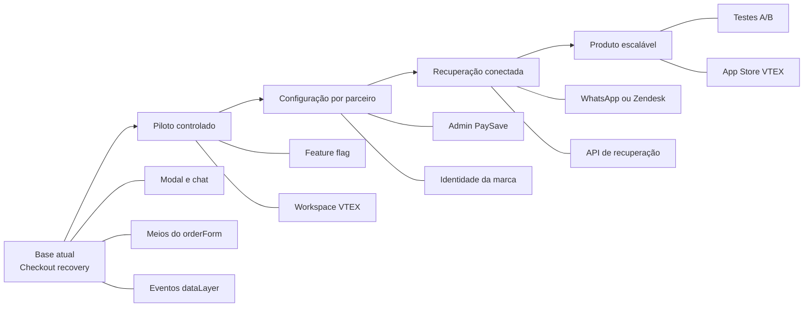
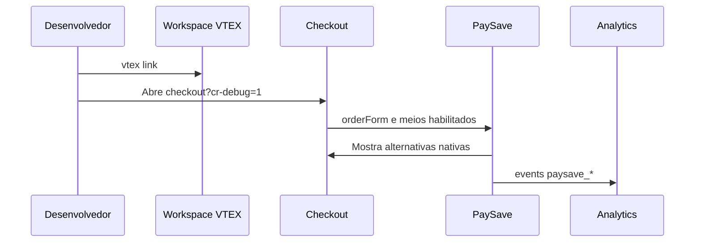
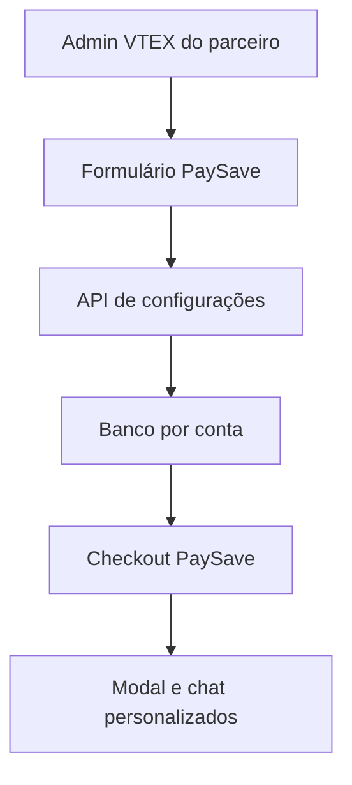

# Roadmap de evolução do PaySave

Este roadmap organiza a evolução por risco e valor. O princípio permanece: o PaySave orienta a recuperação no Checkout, mas nunca captura dados de cartão nem toma decisões financeiras.

## O que já existe

| Capacidade | Status | Como usar |
|---|---|---|
| Modal após recusa confirmada | Pronto para piloto | Recusas por `orderForm`, evento VTEX, resposta do gateway e alerta nativo. |
| Meios de pagamento dinâmicos | Pronto para piloto | Lê `paymentData.paymentSystems` e mostra Pix, cartão e grupos reconhecidos. |
| Escolha no Checkout nativo | Pronto para piloto | Clica no grupo nativo; não cria cobrança. |
| Chat de recuperação | Pronto para piloto | Mostra os mesmos meios da modal e orienta o cliente. |
| WhatsApp, Zendesk ou URL externa | Pronto para piloto | Configure `chatHumanUrl` com URL `https` ou `http`. |
| Cores e textos da marca | Pronto para piloto | Ajuste campos do objeto `S` antes de publicar. |
| Eventos para analytics | Pronto para piloto | Consuma eventos `paysave_*` no GTM ou GA4. |
| Dois cartões nativo | Opcional | Ative somente após confirmar o controle nativo na conta. |

## Prioridade para VTEX

A VTEX tende a valorizar apps que preservam a segurança do Checkout, são simples de instalar, não degradam a conversão e comprovam valor com métricas. A ordem abaixo prioriza esses critérios antes de funcionalidades de CRM ou um dashboard próprio.

| Prioridade | Próxima entrega | Por que é relevante para VTEX | Sinal de conclusão |
|---:|---|---|---|
| P0 | Estabilidade no Checkout | Evita bloqueio de compra e reduz risco em uma superfície crítica. | Sem modal duplicada, sem backdrop preso e rollback testado. |
| P1 | Funil de recuperação mensurável | Demonstra ganho de conversão sem mudar gateway ou pagamento. | Eventos chegam ao GA4/GTM e há baseline de recusa, escolha e retorno. |
| P2 | Catálogo de meios por parceiro | Usa a configuração nativa da VTEX em vez de criar um método paralelo. | Cada meio visível abre o grupo nativo correto. |
| P3 | Configuração no Admin | Permite adoção por parceiros sem editar JavaScript ou usar Toolbelt. | Parceiro ativa, personaliza e desativa o app no Admin. |
| P4 | Suporte externo configurável | Encaminha casos que precisam de ajuda humana sem guardar dados financeiros. | WhatsApp, Zendesk ou CRM configurado por conta. |
| P5 | Experimentos e relatórios | Ajuda parceiros a otimizar o Checkout com decisões orientadas a dados. | Variante, resultado e conversão comparáveis por parceiro. |
| P6 | App Store VTEX | Escala distribuição depois da autonomia e suporte operacional. | Vendor definitivo, documentação, suporte e revisão concluídos. |

## Fase 1: confiabilidade e piloto com uma empresa

**Objetivo:** comprovar que o modal aparece na recusa certa e encaminha para um meio já existente no Checkout.

**Entregas:** textos aprovados, cores aprovadas, lista de meios validada e um canal externo de suporte opcional.

**Métricas para avançar:** nenhuma duplicação da modal, nenhum bloqueio de clique, eventos chegando ao analytics e cada método direcionando ao formulário correto.

**Diferencial apresentado à VTEX:** recuperação pós-recusa usando somente os grupos nativos de pagamento, sem interceptar dados sensíveis ou substituir a decisão do gateway.

## Fase 2: prova de valor e catálogo de meios

**Objetivo:** demonstrar se a recuperação realmente ajuda o parceiro sem alterar a infraestrutura financeira.

1. Crie no GTM/GA4 um funil com `payment_declined`, `recovery_modal_view`, `recovery_option_selected` e `checkout_recovered`.
2. Meça a taxa de visualização após recusa, o meio mais escolhido e o retorno ao formulário de pagamento.
3. Registre os `groupName` disponíveis por parceiro e use fallback somente para grupos não reconhecidos.
4. Não prometa conversão final enquanto não houver uma fonte confiável que correlacione a nova tentativa ou pedido aprovado.

**Diferencial apresentado à VTEX:** inteligência de recuperação baseada no `orderForm`, sem gateway paralelo e sem duplicar meios de pagamento.

## Fase 3: configuração assistida por parceiro

**Objetivo:** atender novos parceiros sem alterar a lógica central de pagamento.

- Criar um perfil versionado para cada parceiro com textos, cores, `chatHumanUrl`, ordem de métodos e feature flags.
- Validar os `groupName` e seletores na workspace de cada conta.
- Publicar uma versão de piloto inicialmente com `enabled: false`; ativar em versão posterior e horário de baixo tráfego.
- Manter rollback documentado para a versão anterior.

**Ainda manual:** uma pessoa técnica ajusta e publica a configuração. Isso é adequado enquanto há poucos parceiros.

## Fase 4: Admin PaySave

**Objetivo:** permitir que cada parceiro personalize sua experiência sem editar JavaScript.

O painel deve oferecer: ativação, nome do assistente, textos, cores, URL de atendimento, ordem de alternativas, split payment, política do alerta nativo e visualização de eventos.

**Critério de conclusão:** uma empresa consegue configurar e desligar o PaySave sem `vtex link` e sem receber uma versão exclusiva.

## Fase 5: recuperação conectada

**Objetivo:** continuar o atendimento quando o cliente sai do Checkout.

- API própria para registrar uma recusa sem dados de cartão.
- Webhook para CRM, suporte ou BI.
- Campanha de e-mail ou WhatsApp após abandono confirmado e base legal adequada.
- Dashboard PaySave para filas, métricas e histórico de recuperação.

**Dados permitidos:** `orderFormId`, item, valor, meio escolhido e origem da recusa. **Dados proibidos:** cartão, CVV, token, senha ou payload bruto de gateway.

## Fase 6: otimização e distribuição

**Objetivo:** escalar com governança.

- Experimentos A/B de textos, ordem dos meios e mensagens de incentivo.
- Relatório por parceiro: recusa, visualização, seleção, retorno ao Checkout e conversão final.
- Monitoramento de erros JavaScript e alertas de regressão.
- Vendor VTEX IO definitivo, documentação pública, política de suporte e submissão à VTEX App Store.

## Ordem recomendada de implementação

1. Fechar o checklist de confiabilidade: modal única, backdrop removido, métodos nativos e rollback.
2. Medir o funil pelo `dataLayer` durante uma ou duas semanas no piloto.
3. Validar todos os `groupName` e meios disponíveis em cada novo parceiro.
4. Configurar WhatsApp ou Zendesk como handoff, sem dados financeiros.
5. Criar perfis de configuração assistidos enquanto há poucos parceiros.
6. Construir o Admin e a API de configuração antes de escalar a instalação.
7. Construir API/dashboard de recuperação quando houver volume que justifique operação.
8. Submeter à App Store somente após configuração autônoma, suporte e evidência de valor.