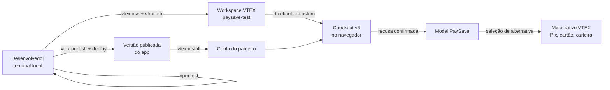
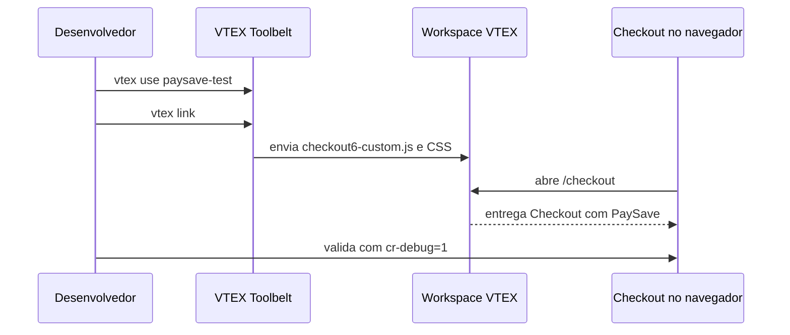

# Guia visual: do código ao Checkout

O PaySave é um app VTEX IO com o builder `checkout-ui-custom`. Não há comando executado *dentro* da tela de Checkout: os comandos rodam no terminal, e a VTEX entrega os arquivos ao Checkout da workspace ou da conta que instalou a versão.



## Escolha o seu caminho

| Objetivo | Onde trabalhar | Comandos necessários |
|---|---|---|
| Conhecer o modal | Navegador | Nenhum comando VTEX. Abra a landing ou a demonstração. |
| Alterar textos, cores ou comportamento | Clone local do projeto | `npm test`, `vtex use`, `vtex link` |
| Testar no Checkout de uma empresa | Terminal + workspace VTEX | `vtex login`, `vtex use`, `vtex link` |
| Disponibilizar uma versão para parceiros | Organização publicadora VTEX IO | `vtex publish`, `vtex deploy` |
| Instalar uma versão já publicada | Terminal da conta parceira | `vtex install FORNECEDOR.paysave@1.x` |

## Caminho recomendado para desenvolvimento

### 1. Preparar o projeto

No diretório do repositório, instale as dependências de teste. O Toolbelt é instalado uma única vez na máquina.

```bash
npm install
npm install -g vtex
npm test
```

O teste verifica o modal, a identificação de recusas, métodos dinâmicos e o isolamento de dados sensíveis. Ele não envia nenhuma solicitação de pagamento.

### 2. Autenticar e criar uma workspace

Use uma conta VTEX na qual você tenha permissão de desenvolvimento. A workspace mantém o teste isolado da URL que clientes acessam.

```bash
vtex login NOME-DA-CONTA
vtex use paysave-test
```

### 3. Vincular o app ao Checkout

Ainda no diretório raiz, execute:

```bash
vtex link
```

Deixe esse processo aberto. Ao alterar `checkout-ui-custom/checkout6-custom.js` ou `checkout-ui-custom/checkout6-custom.css`, a versão vinculada é atualizada na workspace.

### 4. Abrir e testar no navegador

Abra a página abaixo, substituindo os valores pela sua workspace e conta:

```text
https://paysave-test--NOME-DA-CONTA.myvtex.com/checkout?cr-debug=1#/payment
```

O parâmetro `cr-debug=1` abre uma simulação visual do PaySave em uma URL de workspace. Ele não faz uma tentativa de cobrança. Para ver métodos reais, use um carrinho com produto, identificação e entrega preenchidos.

### 5. Alterar a configuração

Edite o objeto `S` em `checkout-ui-custom/checkout6-custom.js` para personalizar nome do assistente, textos, métodos e recursos. Edite `checkout-ui-custom/checkout6-custom.css` para as cores. Após salvar, o `vtex link` atualiza a workspace; recarregue o Checkout no navegador.



## Publicação e instalação para um parceiro

Depois que a workspace estiver validada, a organização que mantém o app publica uma versão. O `vendor` em `manifest.json` identifica essa organização publicadora; ele não deve ser alterado por uma empresa que apenas instalará uma versão já publicada.

```bash
vtex publish
vtex deploy
```

Com a versão publicada, o parceiro instala pelo terminal da própria conta:

```bash
vtex login CONTA-DO-PARCEIRO
vtex install FORNECEDOR.paysave@1.x
```

Após a instalação, a VTEX injeta `checkout6-custom.js` e `checkout6-custom.css` no Checkout v6 dessa conta. O parceiro não precisa copiar scripts no Admin, editar o template do Checkout ou executar qualquer comando dentro do navegador.

## Antes de produção

1. Rode `npm test` na raiz.
2. Valide todos os grupos de pagamento habilitados pelo parceiro em uma workspace.
3. Teste a abertura visual com `cr-debug=1`.
4. Teste uma recusa real apenas com sandbox ou cartão de homologação autorizado pelo gateway.
5. Publique com `enabled: false` se quiser instalar sem ativar o modal imediatamente.
6. Ative `enabled: true` em uma versão nova e monitore os eventos `paysave_*` no `dataLayer`.

Continue em [Configuração](./configuration.md), [Métodos de pagamento](./payment-methods.md) e [Validação](./validation.md) para os detalhes de cada etapa.